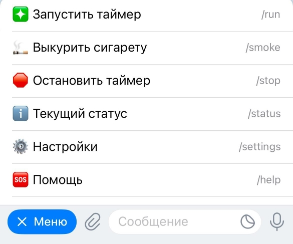
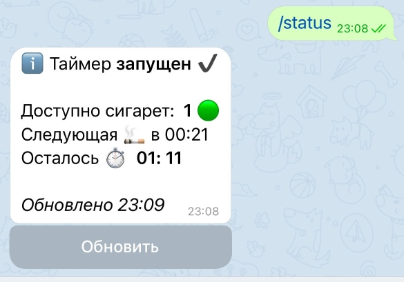

# sgt_smoker 

Телеграм-бот для [*само*]контроля количества выкуриваемых сигарет - следит за интерваллом между сигаретами, по истечении установенного времени информирует о возможности покурить :)

В момент написания README бот живет по адресу https://t.me/sgt_Smokerbot

### Принцип работы

Пользователь устанавливает необходимый ему временной интервал между сигаретами (например, 60 минут), запускает таймер и затем информирует о выкуренных сигаретах.    
Бот следит за временем, считает выкуренные сигареты и сообщает, есть ли в данный момент _доступные_ сигареты и можно ли курить :)    

Поддерживается два режима работы:   
-  ___auto___ : после окончания очередного временного интервала бот увеличивает кол-во досупных сигарет, информирует об этом пользователя и ___сразу___ перезапускает таймер. В данном режиме контролируется __средний интревал__ между сигаретами.
-  ___manual___ : после окончания интервала и информирования пользователя, бот ставит таймер _на паузу_. Таймер перезапускается ___после выкуренной сигареты___. В данном режиме контролируется __минимальный интервал__ между сигаретами.
    
### UI/UX

Общение с ботом осуществляется с помощью кнопки меню внизу экрана. 



Информационное сообщение с такущим статусом:



Интерактивыне команды для установки настроек:

- 🔢⚙️ `/setinterval` - интервал в минутах между сигаретами
- 🔠⚙️ `/setmode` - режим перезапуска таймера: {___авто | вручную___}
- 🔢⚙️ `/setinitial` - начальное кол-во доступных сигарет после запуска
- 🔢⚙️ `/settz` - часовой пояс

### Stack

- python 3.11
- asyncio & contextvars
- telethon

### Dev-deployment

Так как [telethon](https://github.com/LonamiWebs/Telethon) работает непосредственно с [MTProto](https://core.telegram.org/mtproto), для развертывания бота в дополнение к стандартному бот-токену от [@BotFather](https://t.me/BotFather) также понадобятся `api_id` and `api_hash` от [Telegram API](https://core.telegram.org/api/obtaining_api_id#obtaining-api-id).    

⚠ Security warning ⚠: ___В случае дискредитации (утечки) значений `api_id` and `api_hash`, третьи лица могут получить полный доступ к вашему телеграм-аккаунту!___.   

Клонируйте репозиторий, создайте и разверните виртуальное окружение:
```
git clone https://github.com/AV31459/sgt_smoker.git
cd sgt_smoker
python3 -m venv .venv
source .venv/bin/activate
```

Установите зависимости
```
pip install -r requirements.txt
```

Переименуйте `.env.examle` в `.env` и ***укажите `token` вашего бота, `api_id`, `api_hash` и telegram_id для администратора***
```
mv .env.examle .env
vi .env (или любым другим текстовым редактором по вкусу)
```

Локальный запуск (из корня проекта):
```
python3 bot/runner.py
```

### Author

AV31459 - [AV31459](https://github.com/AV31459)  
